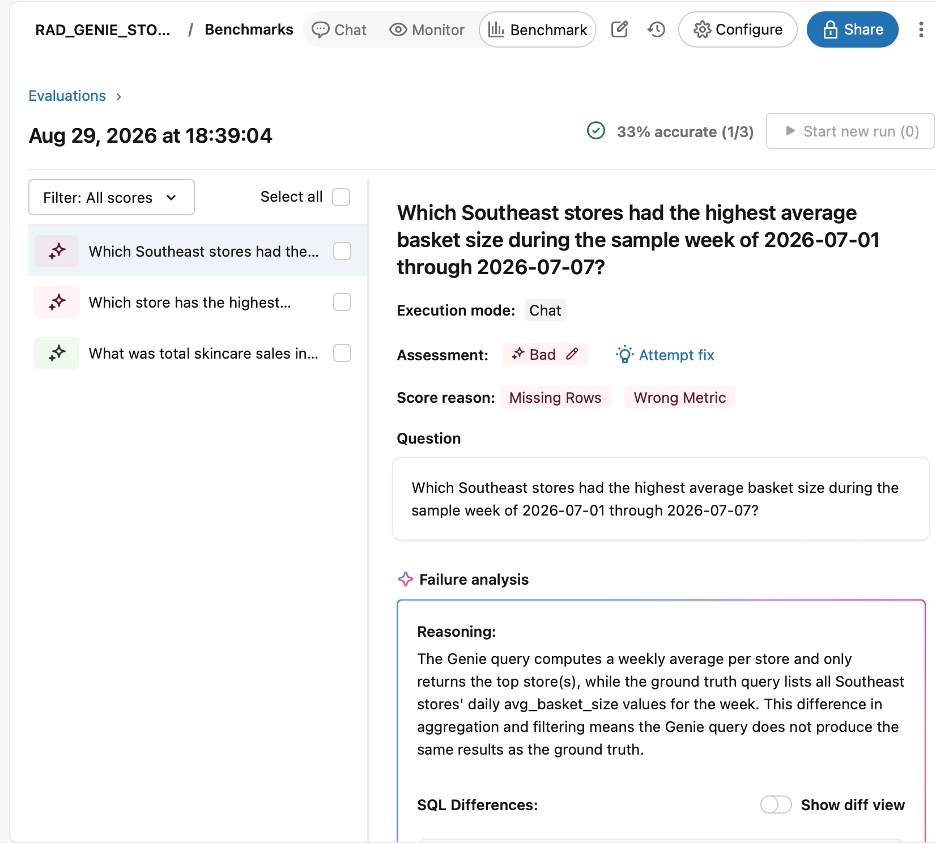
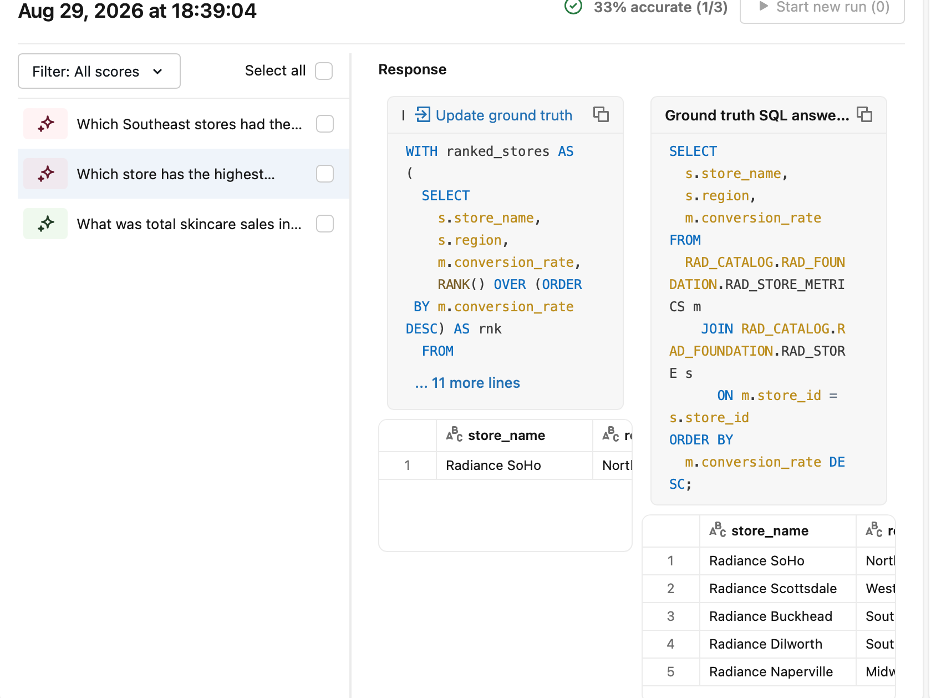

[← Module 02: Genie Agent](module-02-genie-agent.md)  |  [🏠 Home](../README.md)  |  [Module 04: MCP Connectors →](module-04-mcp-connectors.md)

---

## MODULE 03: Databricks Notebooks — Validate & Iterate

**METADATA**
- Time estimate: 25 minutes
- Feature(s) covered: Databricks Notebooks, Genie Agent Conversation API
- Depends on: Module 02 (a working Genie Agent must exist)
- Key artifact created: A Python notebook named `RAD_GENIE_AGENT_API_SMOKE_TEST` that programmatically tests the Genie Agent against benchmark questions

**VIDEO (2 minutes, Synthesia)**

[Watch the Module 03 video here](https://share.synthesia.io/d64d741f-6a5d-49db-8df3-126aa2cbefdd) to learn how Databricks Notebooks help you validate a Genie Agent programmatically rather than relying on one-off chat checks. This video explains why manual testing is not enough, how a Python notebook can send benchmark questions through the Genie Agent Conversation API, and why comparing returned answers against expected business results creates a stronger, repeatable validation story. By the end of the video, participants should understand what they are about to build: `RAD_GENIE_AGENT_API_SMOKE_TEST`, a companion notebook that smoke-tests `RAD_GENIE_STORE_SALES` and exposes the generated SQL and answer payloads for inspection.

**CONCEPT CALLOUT BOXES**

> **CONCEPT: Benchmarks Are Living Documentation**
> Best practice is at least 5 benchmark questions based on real anticipated user questions. These aren't just tests — they double as documentation of what the agent is actually good at, which is valuable when handing the agent off to someone else to maintain.
> **SE TALKING POINT:** "A benchmark suite is proof, not just testing — it's how you show a customer's data team the agent was validated, not just demoed once."

**HANDS-ON STEPS**

1. In this step, you will open the companion **Python notebook** at [`notebooks/RAD_GENIE_AGENT_API_SMOKE_TEST.ipynb`](../notebooks/RAD_GENIE_AGENT_API_SMOKE_TEST.ipynb), because this is where the benchmark testing logic lives.

Import this notebook directly into your Databricks workspace (Workspace left nav > Import > select the `.ipynb` file). If the companion notebook has not been provided in your workspace, create a new Python notebook named `RAD_GENIE_AGENT_API_SMOKE_TEST` instead.

UI ALTERNATIVE: Workspace left nav > Create > Notebook. Make sure the notebook language is **Python** and attach it to notebook compute that supports Python, such as serverless notebook compute or a cluster. Do **not** attach this notebook to a SQL warehouse for this module.

If you created the notebook yourself, paste the full code block from Step 2 into the first Python cell. For this module, one Python cell is enough.

2. In this step, you will call the Genie Agent Conversation API with benchmark questions, because this proves the agent can be tested programmatically, not just manually.

Paste the entire block below into a single Python cell. The helper functions handle the asynchronous conversation start and polling steps for you.

```python
from databricks.sdk import WorkspaceClient
import json
import requests
import time

# Replace with your actual Genie Agent ID, found in Configure > About this agent
# or in the agent URL.
GENIE_AGENT_ID = "[YOUR_GENIE_AGENT_ID]"

benchmark_questions = [
    "Which Southeast stores had the highest average basket size during the sample week of 2026-07-01 through 2026-07-07?",
    "What was total skincare sales in the Southeast region during the sample week of 2026-07-01 through 2026-07-07?",
    "Which store has the highest conversion rate in the sample data?",
]

expected_answers = {
    benchmark_questions[0]: "Radiance Buckhead (RAD-1001) at 40.60, then Radiance Dilworth (RAD-1005) at 33.10",
    benchmark_questions[1]: "42.00 total skincare sales in the Southeast sample week",
    benchmark_questions[2]: "Radiance SoHo (RAD-1002) with conversion_rate 0.3120",
}

workspace_client = WorkspaceClient()
workspace_host = workspace_client.config.host.rstrip("/")
auth_headers = workspace_client.config.authenticate()

# Product terminology is Genie Agent, but the current REST path still uses /genie/spaces/.
def start_conversation(agent_id: str, question: str) -> dict:
    response = requests.post(
        f"{workspace_host}/api/2.0/genie/spaces/{agent_id}/start-conversation",
        headers=auth_headers,
        json={"content": question},
        timeout=60,
    )
    response.raise_for_status()
    return response.json()


def get_message(agent_id: str, conversation_id: str, message_id: str) -> dict:
    response = requests.get(
        f"{workspace_host}/api/2.0/genie/spaces/{agent_id}/conversations/{conversation_id}/messages/{message_id}",
        headers=auth_headers,
        timeout=60,
    )
    response.raise_for_status()
    return response.json()


def wait_for_response(agent_id: str, question: str, poll_seconds: int = 2, timeout_seconds: int = 90) -> dict:
    started = start_conversation(agent_id, question)
    conversation_id = started["conversation"]["id"]
    message_id = started["message"]["id"]

    deadline = time.time() + timeout_seconds
    while time.time() < deadline:
        message = get_message(agent_id, conversation_id, message_id)
        status = message.get("status")
        if status == "COMPLETED":
            return message
        if status in {"FAILED", "CANCELLED"}:
            raise RuntimeError(json.dumps(message, indent=2))
        time.sleep(poll_seconds)

    raise TimeoutError(f"Timed out waiting for response to: {question}")


for question in benchmark_questions:
    print(f"\nTesting Genie Agent question: {question}")
    print(f"Expected answer: {expected_answers[question]}")
    message = wait_for_response(GENIE_AGENT_ID, question)
    print(f"Status: {message.get('status')}")
    print(json.dumps(message, indent=2))
```

3. In this step, you will document the expected answer for each benchmark question, because a test without an expected result is not a real test.

Use these expected answers for the sample data in Section 2b:

```python
expected_answers = {
    "Which Southeast stores had the highest average basket size during the sample week of 2026-07-01 through 2026-07-07?": "Radiance Buckhead (RAD-1001) at 40.60, then Radiance Dilworth (RAD-1005) at 33.10",
    "What was total skincare sales in the Southeast region during the sample week of 2026-07-01 through 2026-07-07?": "42.00 total skincare sales in the Southeast sample week",
    "Which store has the highest conversion rate in the sample data?": "Radiance SoHo (RAD-1002) with conversion_rate 0.3120",
}
```

**VALIDATION CHECKPOINT**
```
-- VALIDATION: Module 03 — confirms the notebook runs end-to-end
-- Run all cells in the notebook.
-- Expected: no errors, and each benchmark question returns Status: COMPLETED.
-- You should also see a JSON response payload for each question, including the
-- generated SQL and a text answer from the Genie Agent.
-- Expected business answers for the sample data:
--   1) Highest Southeast average basket size: Radiance Buckhead (RAD-1001)
--      at 40.60, ahead of Radiance Dilworth (RAD-1005) at 33.10.
--   2) Southeast skincare sales during the sample week: 42.00.
--   3) Highest conversion rate in the sample data: Radiance SoHo (RAD-1002)
--      at 0.3120.
-- If you only see the questions printed and no JSON response, you are still
-- running a scaffold version of the notebook rather than the full API test.
-- If you see an authentication error, confirm your notebook compute has
-- permission to call the Genie Agent.
```

> **CONCEPT: Notebook Smoke Tests vs Formal Evaluations**
> This notebook is a programmatic smoke test and integration check: it proves the Genie Agent can be called through code and returns inspectable responses. It is not the same thing as a formal benchmark evaluation. Formal evaluations live in the Genie Agent **Benchmarks** tab, where Databricks runs benchmark questions at scale and scores accuracy over time.
> **SE TALKING POINT:** "The notebook proves the agent works through an API; the Benchmarks tab proves it stays accurate as you tune it."

4. In this step, you will run a formal benchmark evaluation in the Genie Agent UI, because the notebook smoke test proves API connectivity while the Benchmarks experience proves repeatable accuracy.

Open `RAD_GENIE_STORE_SALES` and click **Benchmark**.

### Documentation references

For the official Databricks documentation behind this workflow, use:

* [Genie Agent benchmarks and monitoring overview](https://docs.databricks.com/aws/en/genie-agents/monitor/)
* [Genie Agents Conversation API](https://docs.databricks.com/aws/en/genie-agents/conversation-api/)
* [Databricks notebooks overview](https://docs.databricks.com/aws/en/notebooks/index/)
* [Notebook compute](https://docs.databricks.com/aws/en/notebooks/notebook-compute/)
* [Serverless compute for notebooks](https://docs.databricks.com/aws/en/compute/serverless/notebooks/)

### How the Benchmark page is organized

The Benchmark page has two different layers:

* **Questions** stores the benchmark questions you define
* **Evaluations** shows the results of benchmark runs after you execute them

If you add benchmark questions and then click **Evaluations** immediately, you may still see **No evaluation runs found**. That is expected. It means your questions are saved, but you have not run them yet.

You may also see **Add benchmark** from either view. That is expected too. The button is available in multiple places so you can create benchmark questions from wherever you are in the Benchmark page. It does not mean a run has already been created.

### Important clarification on Chat mode vs Agent mode

According to the Databricks benchmarks documentation, you choose **Chat** or **Agent** mode when you **run** benchmarks, not when you create the benchmark questions.

That means:

* create and save your benchmark questions first
* then choose the benchmark mode for the run
* then review the run results in **Evaluations**

### Recommended mode for this lab

Use **Chat** mode first.

Why:

* Chat mode is the default benchmark mode
* it compares Genie-generated results against your ground-truth SQL answer
* it is the clearest fit for this lab’s three SQL-backed benchmark questions
* it creates the simplest, most defensible workshop story for repeatable validation

Use **Agent** mode only as an optional advanced follow-on:

* Agent mode uses the broader multi-step reasoning flow of the agent experience
* it can use an optional **evaluation note**
* it is more useful when you want to assess richer natural-language outputs, not just SQL-equivalent results

### Step-by-step: add and run benchmarks for this lab

1. In `RAD_GENIE_STORE_SALES`, click **Benchmark**.
2. Stay on the **Questions** tab.
3. Click **Add benchmark**.
4. Add these three benchmark questions:
   * Which Southeast stores had the highest average basket size during the sample week of 2026-07-01 through 2026-07-07?
   * What was total skincare sales in the Southeast region during the sample week of 2026-07-01 through 2026-07-07?
   * Which store has the highest conversion rate in the sample data?
5. For each benchmark, paste the corresponding **ground truth SQL answer** shown below.
6. Save the benchmarks.
7. Confirm that the **Questions** tab now shows all three saved questions.
8. Before running the evaluation, switch to **Chat** mode.
9. Click **Run all benchmarks**.
10. Open the **Evaluations** tab.
11. Wait for the run to complete.
12. Click the completed evaluation run to inspect accuracy, generated SQL, and any failures.

### Ground truth SQL answers

```sql
-- Benchmark 1 SQL answer
SELECT s.store_name, m.avg_basket_size
FROM RAD_CATALOG.RAD_FOUNDATION.RAD_STORE_METRICS m
JOIN RAD_CATALOG.RAD_FOUNDATION.RAD_STORE s
  ON m.store_id = s.store_id
WHERE s.region = 'Southeast'
  AND m.metric_date BETWEEN DATE '2026-07-01' AND DATE '2026-07-07'
ORDER BY m.avg_basket_size DESC;

-- Benchmark 2 SQL answer
SELECT SUM(t.sale_amount) AS total_skincare_sales
FROM RAD_CATALOG.RAD_FOUNDATION.RAD_SALES_TXN t
JOIN RAD_CATALOG.RAD_FOUNDATION.RAD_STORE s
  ON t.store_id = s.store_id
JOIN RAD_CATALOG.RAD_FOUNDATION.RAD_SKU_LOOKUP sk
  ON t.sku_id = sk.sku_id
WHERE s.region = 'Southeast'
  AND sk.category = 'skincare'
  AND t.sale_date BETWEEN DATE '2026-07-01' AND DATE '2026-07-07';

-- Benchmark 3 SQL answer
SELECT s.store_name, s.region, m.conversion_rate
FROM RAD_CATALOG.RAD_FOUNDATION.RAD_STORE_METRICS m
JOIN RAD_CATALOG.RAD_FOUNDATION.RAD_STORE s
  ON m.store_id = s.store_id
ORDER BY m.conversion_rate DESC;
```

### Optional: run the same questions in Agent mode

If you want to demonstrate the more advanced benchmark workflow after Chat mode passes:

1. Stay in the **Benchmark** page.
2. Switch from **Chat** to **Agent** mode.
3. Reuse the same three questions.
4. Keep the SQL answer for each benchmark.
5. Optionally add an **evaluation note** describing what a correct answer must contain.
6. Click **Run all benchmarks** again.
7. Review the Agent-mode evaluation results separately in **Evaluations**.

### Best-practice framing for participants

* Use the **Python notebook** to validate API connectivity, inspect raw generated SQL, and debug responses.
* Use **Benchmarks** to run formal evaluations repeatedly as you refine instructions, examples, and trusted assets.
* Treat **Questions** as your benchmark library.
* Treat **Evaluations** as your run history and scorecard.
* Do not assume a saved benchmark has been evaluated until you click **Run all benchmarks**.
* If results are missing, first confirm you are in the same mode where you ran the benchmarks.
* As an SA, benchmark evaluations are the stronger competitive proof point because they show the agent was measured systematically, not just demoed once live.

### Reading benchmark results: what passed, what failed, and what to do next

The screenshots below are intentionally useful for teaching because they show that a failed benchmark does not always mean the Genie Agent is bad. Sometimes the benchmark question, the benchmark SQL, and the agent's interpretation are testing slightly different things.

> **NOTE: Start by checking question-to-SQL alignment**
> In **Chat** mode, Databricks scores the Genie-generated result set against the **ground truth SQL answer** very literally. If the benchmark question asks for the **top store only**, but the ground truth SQL returns **all stores ordered by a metric**, the benchmark can score **Bad** even when the agent's reasoning is sensible.

> **CALLOUT: Why these results are so useful in an SA workshop**
> These results create exactly the right teaching moment: Databricks is not just generating an answer, it is exposing where business wording, expected SQL, and actual agent behavior are misaligned. That is a strength, not a weakness. It gives the SA a concrete way to show that the system is measurable, inspectable, and improvable.

#### Screenshot 1 — Benchmark run summary



Caption: The benchmark run summary shows one passing benchmark and two failing benchmarks. This is valuable because it proves the evaluation system is distinguishing between aligned and misaligned benchmark definitions rather than blindly passing everything.

> **NOTE: What happened in Benchmark 1**
> The question asks for the Southeast store or stores with the **highest average basket size** during the sample week. But the current ground truth SQL returns **all Southeast rows ordered by `avg_basket_size`**, while Genie computed a **weekly average per store** and returned only the top-ranked store or stores. The score reason is useful: **Missing Rows** and **Wrong Metric** together suggest a mismatch between the intended business question and the benchmark SQL, not necessarily a broken agent.

> **SA GUIDANCE: What to try first**
> First, review the benchmark SQL before changing the agent. Ask: does the SQL truly represent the business question as written? If the business question is about the **top store**, the ground truth SQL should usually return only the top-ranked result or tied top-ranked results. If the business question is about **all Southeast stores and their basket sizes**, then the question wording should be rewritten to match that broader result set.

#### Screenshot 2 — Failed benchmark for highest conversion rate



Caption: This result shows a classic benchmark-definition problem: the question asks for the single highest store, but the benchmark SQL returns the full ordered list of stores.

> **NOTE: What happened in Benchmark 2**
> Genie answered the question in the most natural way: it returned the store with the highest conversion rate. The benchmark SQL, however, returns **all stores ordered by `conversion_rate`**. Because Chat-mode scoring compares the returned result sets, Genie is penalized for not returning rows that the question itself did not clearly ask for.

> **CALLOUT: This is not a random failure**
> This is the kind of failure you want in a workshop because it surfaces a real best practice: benchmark SQL must match the **shape** of the expected answer, not just the table and column names. Top-1 questions, tie-preserving questions, aggregate questions, and full ranked-list questions all need different SQL shapes.

#### Screenshot 3 — Passing benchmark for total skincare sales

The third benchmark, **"What was total skincare sales in the Southeast region during the sample week of 2026-07-01 through 2026-07-07?"**, passed. It passed because the question, the expected business answer, and the ground truth SQL were all aligned around a single aggregate metric.

### What we would encourage SAs to play with

> **CALLOUT: Recommended tuning order**
> When a benchmark fails, do not assume the Genie Agent is wrong first. Work in this order:
>
> * Check whether the **benchmark question wording** matches the intended output shape.
> * Check whether the **ground truth SQL** matches that wording exactly.
> * Use **Attempt fix** to inspect the failure analysis and suggested repair, but do not accept changes blindly.
> * Only after the benchmark itself is well-formed should you tune the Genie Agent with instructions, example SQL, or additional context.

For this lab, encourage SAs to experiment with:

* **Rewriting the benchmark question** so it clearly asks for either a single top result, tied top results, or a full ranked list.
* **Updating the ground truth SQL** so it matches the question exactly.
* **Trying Attempt fix** to inspect Databricks' explanation of the mismatch and compare it to their own reasoning.
* **Adding or refining example SQL** in the Genie Agent for ranking, aggregation, and top-N patterns.
* **Adding more explicit instructions** such as: when a user asks for the store with the highest value of a metric, return only the top-ranked store unless the user asks for a full ranking; preserve ties when multiple stores share the same top value.
* **Re-running benchmarks immediately after each change** so they can see whether the pass rate improves.

> **SA TALKING POINT: Why this is a competitive strength**
> A chat-only demo can hide ambiguity. A benchmark evaluation exposes it. That is exactly why benchmark workflows are so important in technical sales: they let you turn ambiguity into a measurable improvement cycle instead of arguing subjectively about whether an answer 'looks right.'

### Guidance on **Attempt fix** vs other actions

> **NOTE: When to use Attempt fix**
> Use **Attempt fix** when you want Databricks to help explain the mismatch and suggest what to adjust. It is especially useful as a teaching tool because it makes the scoring logic visible.

> **NOTE: When to update the benchmark instead**
> If the question and the ground truth SQL are clearly misaligned, update the benchmark definition first. In these screenshots, that is the most likely next step for the two failing benchmarks.

> **NOTE: When to tune the Genie Agent instead**
> Tune the Genie Agent only after you are confident the benchmark is well-formed. At that point, if Genie is still wrong, experiment with clearer instructions, better example SQL, or more explicit source-of-truth guidance.

**"WHY THIS WINS" — SE TALKING POINTS**
- **TECHNICAL DIFFERENTIATOR:** Genie Agents are testable via API, not just a black-box chat window — enabling real CI-style validation before rollout.
- **BUSINESS VALUE:** Reduces the risk of shipping an agent that confidently gives wrong answers, protecting trust in the tool from day one.

---


---

[← Module 02: Genie Agent](module-02-genie-agent.md)  |  [🏠 Home](../README.md)  |  [Module 04: MCP Connectors →](module-04-mcp-connectors.md)
